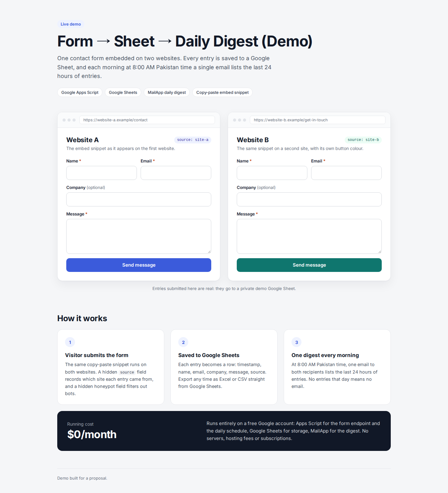

# Form → Sheet → Daily Digest

A contact form you can embed on any number of websites. Every entry is saved to a Google Sheet, and every
morning at 8:00 AM Pakistan time (Asia/Karachi) **one** email goes to your recipients with the last 24 hours
of entries. No entries that day, no email. Runs on Google Apps Script for **$0/month**.

**Live demo:** https://eslamnumber.github.io/form-digest-demo/

| Path | What it is |
|---|---|
| `apps-script/Code.gs` | Form endpoint (`doPost`), daily digest (`sendDailyDigest`), `sendDigestNow`, `setup` |
| `apps-script/appsscript.json` | Manifest: Asia/Karachi time zone, public web app, minimal permissions |
| `embed/embed-snippet.html` | The snippet you paste into each website (HTML + CSS + JS, no dependencies) |
| `demo/index.html` | Demo page: the same form on "Website A" and "Website B" |

## Setup (about 10 minutes)

1. **Create the Sheet and script.** Install clasp (`npm i -g @google/clasp`), run `clasp login`, and turn on the
   Apps Script API at https://script.google.com/home/usersettings. Then, inside `apps-script/`, run
   `clasp create --type sheets --title "Contact form entries"`. This creates a new Google Sheet with the script
   attached to it.
2. **Push the code.** `clasp create` replaces `appsscript.json` with Google's default, so restore ours first:
   `git checkout appsscript.json && clasp push --force`.
3. **Run `setup()` once:** `clasp open-script`, choose `setup` in the function list, click **Run** and approve
   Google's permission screen (tick **Select all** if it shows checkboxes). It adds the header row, sends digests to your own address by default and
   installs the daily 8:00 AM trigger. Running it again is safe.
4. **Deploy the web app:** `clasp deploy --description "v1"`. Your form URL is
   `https://script.google.com/macros/s/<deployment id>/exec`.
5. **Paste that URL** into `data-endpoint="..."` in `embed/embed-snippet.html`.
6. **Embed it on both websites:** paste the snippet into each site (any HTML or "custom code" block works:
   WordPress, Webflow, Wix, plain HTML). Set the hidden `source` value to `site-a` on one site and `site-b` on
   the other, so every row shows where it came from.

No terminal? Create a Sheet, open **Extensions → Apps Script**, paste `Code.gs` (and `appsscript.json` after
ticking "Show appsscript.json" in Project Settings), then do steps 3–6 in the editor
(**Deploy → New deployment → Web app**, execute as *Me*, access *Anyone*).

To ship code changes later without changing the form URL: `clasp push`, then
`clasp deploy --deploymentId <deployment id>`.

## Change recipients

Script editor → **Project Settings** (gear icon) → **Script properties** → edit `RECIPIENTS`
(comma-separated, e.g. `sales@example.com, owner@example.com`). It applies from the next digest; no redeploy.

## Export entries

Open the Sheet → **File → Download** → Microsoft Excel (.xlsx) or CSV.

## Monthly cost

**$0.** Apps Script, Google Sheets and MailApp are included with a free Google account (or an existing
Google Workspace). No server, hosting or subscription.

## Limits

- **Email quota:** MailApp allows 100 recipients/day on a free Gmail account (1,500 on Google Workspace).
  The digest uses 2 per day (one email, two recipients).
- **Timing:** Google runs daily triggers within about 15 minutes of the set time, so the digest arrives
  between roughly 7:45 and 8:15 AM. It lists the 24 hours before it runs, so an entry sent in those
  minutes can appear in two digests or in neither. Every entry is always in the Sheet.
- **Spam:** a hidden honeypot field drops most bots. Add a CAPTCHA if a site attracts targeted spam.
- **Testing:** run `sendDigestNow()` in the editor to send the digest immediately (nothing is sent if the
  last 24 hours are empty).
